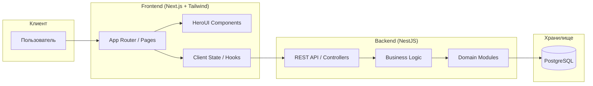

<div align="center">

# SpotWave

**Инструмент для поиска единомышленников и организации гипер-локальных событий в реальном времени**

[](https://nextjs.org/)
[](https://nestjs.com/)
[](https://www.prisma.io/)
[](https://tailwindcss.com/)

</div>

---

## Содержание

- [О проекте](#о-проекте)
- [Архитектура](#архитектура)
- [Быстрый старт](#быстрый-старт)
- [Команды](#команды)

---

## О проекте

### Проблема
В больших городах люди часто чувствуют социальную изоляцию, даже живя в окружении тысяч соседей. Поиск компании для простых активностей (настольные игры, спорт, прогулки) в своем районе через общие чаты Telegram или группы ЖК часто неэффективен: сообщения теряются в спаме, а поиск происходит вручную и хаотично.

### Решение
**SpotWave** — это платформа для гипер-локального взаимодействия. С помощью интерактивной карты и умных фильтров пользователи могут мгновенно находить события «здесь и сейчас» в радиусе нескольких километров от себя. Система позволяет быстро объединяться в группы по интересам, отсекать нерелевантные предложения и безопасно организовывать встречи с соседями.

---

## Архитектура



---

## Быстрый старт

### Требования

<div align="center">

| Компонент | Минимум | Рекомендуется |
| :-------: | :-----: | :-----------: |
|  Node.js   |  18.18+ |      20+      |
|   pnpm     |   8+    |      10+       |

</div>

### Клонирование репозитория

```bash
git clone https://github.com/your-org/spotwave.git
cd spotwave
```

### Установка зависимостей

```bash
pnpm install
```

### Запуск приложения

```bash
pnpm dev
```

---

## Команды

### Root

```bash
# Запуск всех сервисов в режиме разработки
pnpm dev

# Запуск только frontend
pnpm dev:frontend

# Запуск только backend
pnpm dev:backend

# Сборка всех пакетов
pnpm build

# Сборка только frontend
pnpm build:frontend

# Сборка только backend
pnpm build:backend

# Автоисправление линтинга + форматирование
pnpm lint:fix

# Форматирование всего репозитория
pnpm format
```

### Frontend

```bash
# Запуск разработки
pnpm --filter @spotwave/frontend dev

# Сборка для продакшена
pnpm --filter @spotwave/frontend build

# Линтинг
pnpm --filter @spotwave/frontend lint
```

### Backend

```bash
# Запуск в режиме разработки (watch mode)
pnpm --filter @spotwave/backend start:dev

# Сборка проекта
pnpm --filter @spotwave/backend build

# Запуск тестов
pnpm --filter @spotwave/backend test
```

### Docker (локально)

```bash
# Запуск всех сервисов (build + up) из корня
docker compose -f infrastructure/docker/docker-compose.yml up --build

# Запуск в фоне
docker compose -f infrastructure/docker/docker-compose.yml up -d

# Остановить и удалить контейнеры
docker compose -f infrastructure/docker/docker-compose.yml down

# Просмотр логов
docker compose -f infrastructure/docker/docker-compose.yml logs -f

# Пересборка образов без кеша
docker compose -f infrastructure/docker/docker-compose.yml build --no-cache
```